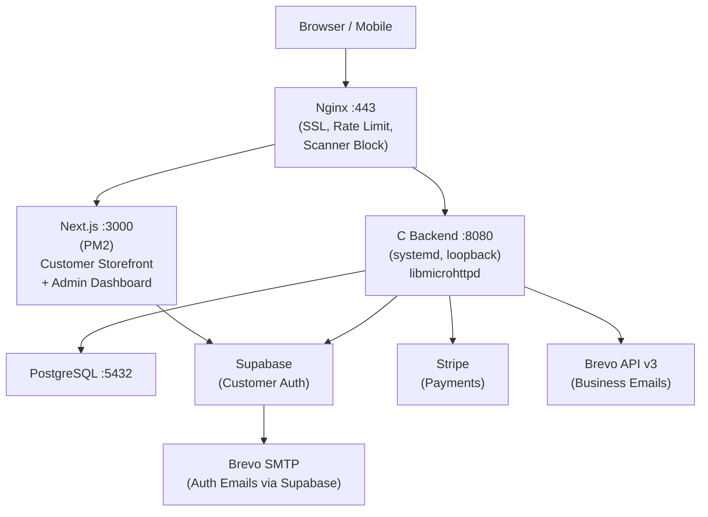
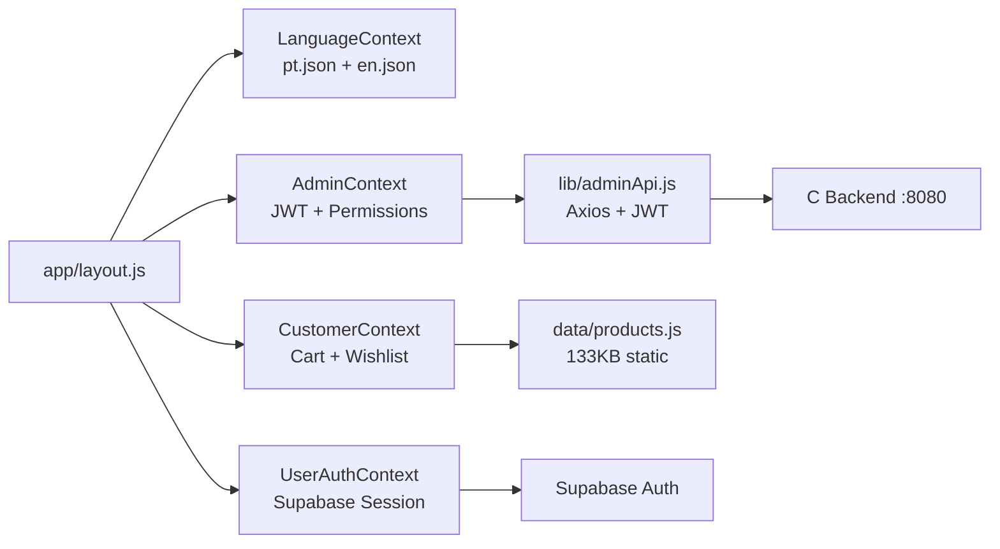
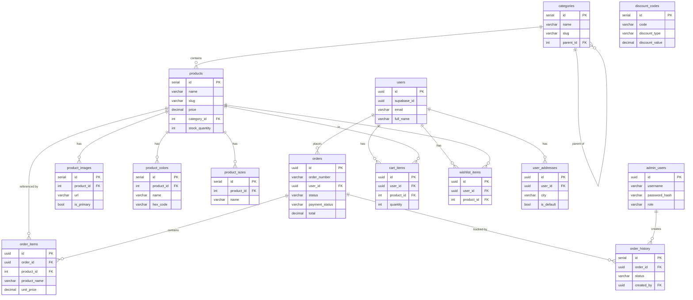
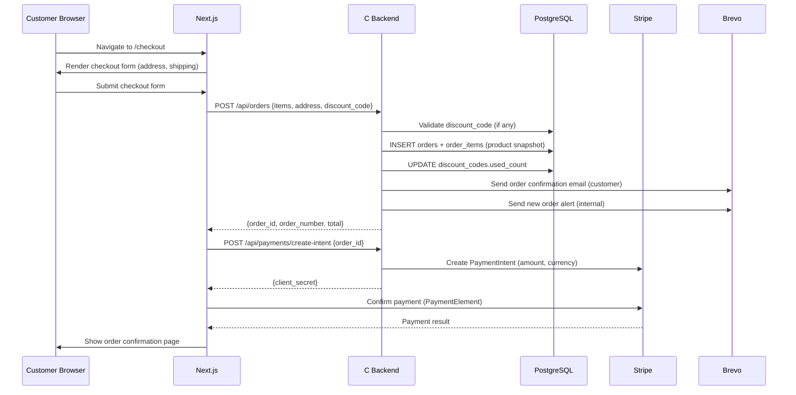
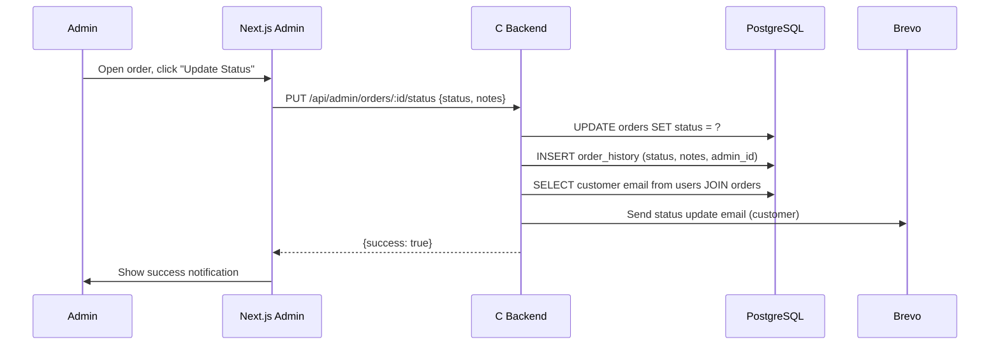
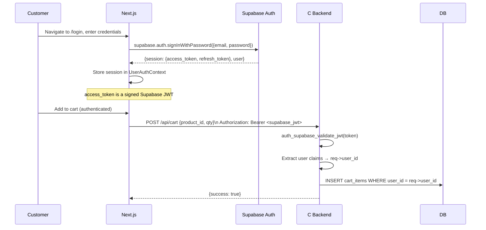
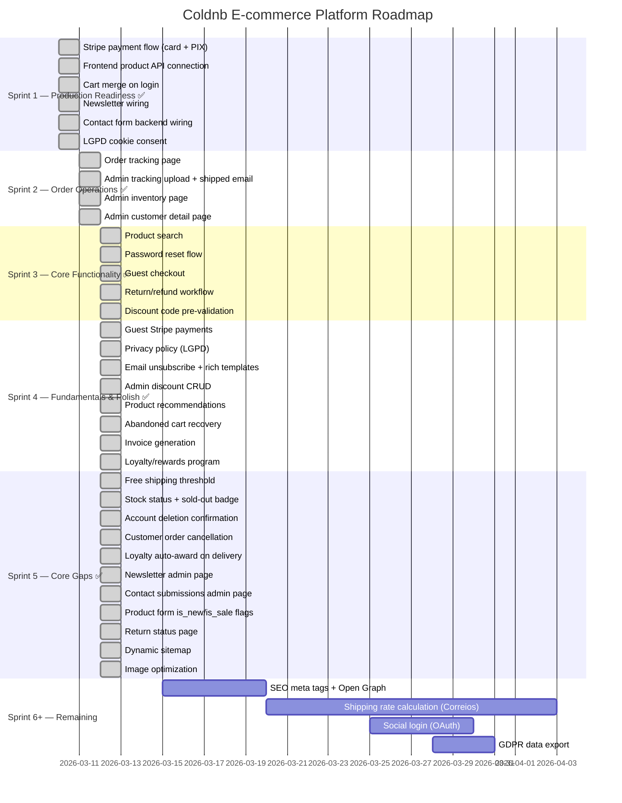

# Coldnb — Complete Codebase & Product Analysis

> Generated: 2026-03-10 | Updated: 2026-03-12 (Sprint 4 complete) | Analyst: Context Engineering Session

---

## 1. Executive Summary

Coldnb is a full-stack jewelry e-commerce platform built for the Brazilian market. It consists of a Next.js 15 + React 19 customer storefront (bilingual PT-BR/EN) and a C/libmicrohttpd backend connected to PostgreSQL, with Supabase handling customer authentication and Brevo providing email delivery. The admin dashboard supports product management, order operations, customer data, analytics, and email configuration.

The platform demonstrates significant technical ambition — a custom C backend for performance, a mature dual-auth architecture, a comprehensive PostgreSQL schema covering the full e-commerce domain, and a production-ready deployment stack on DigitalOcean with Nginx, PM2, systemd, UFW, CrowdSec, and fail2ban. Email transactional flows (order confirmation, status updates, contact notifications) are live.

As of Sprint 4 (2026-03-12), all three original P0 blockers have been resolved: (1) **Stripe payment integration is complete** — backend handlers, PaymentElement checkout (card + PIX), webhook handling, and guest Stripe payments are built (VPS Stripe key config pending); (2) **frontend product browsing is API-driven** — shop/detail/homepage pages fetch from `/api/products`; (3) **cart merge on login** is implemented via `mergeCartOnLogin()` in UserAuthContext.

Sprint 2 added order tracking (public tracking page + admin tracking upload + shipped email), admin inventory management, and admin customer detail pages. Sprint 3 added product search, password reset, reorder button, discount code pre-validation, guest checkout, and return/refund workflow. Sprint 4 added guest Stripe payments, privacy policy (LGPD), email unsubscribe (HMAC-based), rich HTML email templates, admin discount CRUD, product recommendations, abandoned cart recovery, invoice generation, and a loyalty/rewards program.

**Top 3 recommended next actions:**
1. Configure Stripe live keys on VPS and apply DB migrations 006–008
2. Implement SEO meta tags and sitemap generation for organic discovery
3. Build real-time shipping rate calculation (Correios integration)

---

## 2. System Architecture Overview

### Architecture Style
**Modular Monolith (frontend) + Monolithic C HTTP Server (backend)**. No microservices. All backend logic runs in a single binary (`coldnb-server`) registered as a systemd service.

The architecture deliberately separates concerns by layer: Nginx handles SSL/TLS termination, rate limiting, and public exposure; Next.js handles the full customer UX (SSR + client-side React); the C backend handles all business logic and data operations; PostgreSQL is the single source of truth for persistent data.



---

## 3. Technology Stack

| Layer | Technology | Version | Purpose |
|-------|-----------|---------|---------|
| Frontend framework | Next.js | 15.x | App Router, SSR + CSR hybrid |
| UI library | React | 19.0.0 | Component model |
| CSS framework | Bootstrap | 5.3.2 | Layout and utilities |
| Styling | SCSS | — | Custom brand styles |
| Icons | icomoon (custom) | — | E-commerce icon set |
| Animations | WOW.js | — | Scroll reveal animations |
| Carousels | Swiper | 11.1.15 | Product carousels |
| Charts | Chart.js + react-chartjs-2 | 4.x | Admin analytics charts |
| HTTP client | Axios | 1.x | API calls (admin API with JWT interceptor) |
| Customer auth client | @supabase/supabase-js | 2.x | Supabase Auth integration |
| Date utilities | date-fns | 3.x | Date formatting |
| Image handling | react-dropzone + react-easy-crop | — | Admin image upload/crop |
| Image viewer | PhotoSwipe | 5.x | Product image gallery |
| Notifications | react-hot-toast | — | Cart/wishlist toast messages |
| Backend language | C | GCC 9+ | High-performance HTTP server |
| Backend HTTP | libmicrohttpd | — | HTTP server library |
| Backend DB driver | libpq | — | PostgreSQL C client |
| Backend HTTP client | libcurl | — | External API calls (Brevo, Stripe) |
| Backend JSON | cJSON | — | JSON parsing/generation |
| Backend crypto | libsodium | — | Argon2id password hashing |
| Backend TLS | OpenSSL | — | JWT signature verification |
| Backend UUID | libuuid | — | UUID generation |
| Database | PostgreSQL | 13+ | Primary data store |
| Customer auth provider | Supabase | — | Managed auth (JWT, email) |
| Payment provider | Stripe | — | Payment processing (partial) |
| Transactional email | Brevo API v3 | — | Business emails |
| Auth email relay | Brevo SMTP | — | Auth emails via Supabase |
| Process manager | PM2 | — | Next.js process management |
| System service | systemd | — | Backend service management |
| Reverse proxy | Nginx | — | SSL, rate limiting, routing |
| SSL | Let's Encrypt | — | TLS certificates |
| Firewall | UFW | — | Port restrictions |
| Threat intelligence | CrowdSec | — | Automated threat blocking |
| Brute-force protection | fail2ban | — | SSH protection |
| Platform | DigitalOcean Ubuntu 24.04 | — | 2vCPU/2GB droplet |

---

## 4. Repository Structure

```
coldnb/
├── CLAUDE.md                    ← AI routing manifest
├── PROJECT_CONTEXT.md           ← Tool-agnostic project reference
├── CODEBASE_ANALYSIS.md         ← This file
├── memory-bank/                 ← AI session memory (6 files)
├── docs/                        ← Deep technical documentation
├── .claude/rules/               ← Path-scoped AI rules (3 files)
│
├── coldnb main/coldnb nextjs/   ← FRONTEND (space in name — always quote)
│   ├── app/
│   │   ├── (homes)/             ← 18 homepage theme variants
│   │   ├── (products)/          ← 7+ shop listing layouts
│   │   ├── (productDetails)/    ← 25+ product detail variants
│   │   ├── (my-account)/        ← Account, addresses, orders, loyalty (5 pages)
│   │   ├── (admin)/admin/       ← Admin dashboard (12+ pages)
│   │   ├── (other-pages)/       ← Cart, checkout, contact, auth, privacy, unsubscribe, invoice (18+ pages)
│   │   ├── (blogs)/             ← Blog pages (4 layouts)
│   │   ├── api/admin/upload/    ← Image upload API route
│   │   └── layout.js            ← Root layout
│   ├── components/              ← 33+ component subdirectories
│   │   ├── admin/               ← AdminSidebar, AdminHeader, dashboard cards
│   │   ├── headers/             ← 11 header + 11 topbar variants
│   │   ├── modals/              ← Cart, QuickView, Compare, Wishlist, etc.
│   │   ├── productCards/        ← 14 product card variants
│   │   ├── productDetails/      ← Gallery, tabs, related products
│   │   ├── products/            ← Filters, grid, list views
│   │   └── common/              ← Shared components
│   ├── context/                 ← 5 React Contexts
│   ├── lib/                     ← adminApi.js, shopApi.js, loyaltyApi.js, adminDiscounts.js + i18n system
│   ├── data/                    ← Static data files (products 133KB, etc.)
│   ├── public/scss/             ← Bootstrap + 31 SCSS partials
│   └── utlis/                   ← Utility functions (typo intentional)
│
└── coldnb-backend/              ← BACKEND (C)
    ├── src/
    │   ├── handlers/            ← ~16 handler files
    │   ├── services/            ← svc_email, svc_jwt, svc_admin_auth
    │   ├── clients/             ← client_brevo, client_stripe
    │   ├── db/                  ← db_connection (pool), db_query
    │   ├── auth/                ← auth_supabase, auth_middleware
    │   ├── middleware/          ← rate_limit, analytics
    │   ├── util/                ← string, json, hash, uuid helpers
    │   ├── http/                ← http_server, http_router, http_request, http_response
    │   └── main.c               ← Entry point, route registration
    ├── include/                 ← Header files (mirrors src/)
    ├── sql/                     ← 8 migration files (001–008)
    ├── config/                  ← server.conf + secrets/ directory
    ├── scripts/                 ← dev_setup.sh, setup_production.sh
    └── Makefile
```



---

## 5. Data Architecture

### Core Entities

**users** — Synced from Supabase Auth (id, supabase_id, email, full_name, phone, avatar_url, is_active, email_verified)

**admin_users** — Independent admin accounts (username, email, password_hash [Argon2id], role, permissions)

**categories** — Hierarchical product categories (id, name, slug, description, parent_id, image_url, sort_order)

**products** — Product catalog (id, name, slug, description, sku, price, compare_at_price, cost_price, category_id, brand, stock_quantity, low_stock_threshold, is_active, is_featured, is_new, is_sale, meta_title, meta_description)

**product_images / product_colors / product_sizes** — Product variants (CASCADE delete on product)

**product_tags + product_tag_assignments** — Many-to-many tag system

**user_addresses** — Shipping addresses (label, recipient_name, street, city, state, postal_code, is_default)

**cart_items** — Server-side cart (user_id, product_id, quantity, color_id, size_id; UNIQUE constraint)

**wishlist_items** — Server-side wishlist (user_id, product_id; UNIQUE constraint)

**discount_codes** — Coupon codes (code, discount_type [percentage/fixed], discount_value, minimum_order, usage_limit, starts_at, expires_at)

**orders** — Orders (order_number, user_id, status, payment_status, payment_method, payment_id; shipping address snapshot; subtotal, shipping_cost, tax_amount, discount_amount, total; paid_at, shipped_at, delivered_at, cancelled_at)

**order_items** — Line items with product snapshot (product_name, product_sku, product_image, color_name, size_name, quantity, unit_price, total_price)

**order_history** — Status change audit trail (order_id, status, notes, created_by admin_id)

**newsletter_subscribers** — Email list (email, name, brevo_id, is_active)

**contact_submissions** — Contact form records (name, email, phone, subject, message, is_read)

**analytics_page_views / analytics_product_views** — Built-in analytics (session_id, user_id, path, product_id)

**admin_sessions** — Admin JWT tracking (token_hash, ip_address, expires_at)

**order_returns** — Return requests (order_id, user_id, reason, description, status [requested/under_review/approved/rejected/refunded], admin_notes, refund_amount)

**abandoned_cart_emails** — Recovery email tracking (user_id, sent_at; one per user per cooldown period)

**loyalty_points** — Points ledger (user_id, points [positive=earned, negative=spent], reason, reference_type, reference_id)

**loyalty_rewards** — Rewards catalog (name, description, points_cost, reward_type, reward_value, is_active)

**loyalty_redemptions** — Redemption records (user_id, reward_id, points_spent, discount_code, redeemed_at)



---

## 6. Key System Flows

### Checkout & Payment Flow



### Order Fulfillment & Notification Flow



### User Authentication Flow



---

## 7. External Integrations

| Service | Purpose | Status | Notes |
|---------|---------|--------|-------|
| Supabase Auth | Customer identity, session management | ✅ Live | JWT validated in `auth_supabase.c`; email verified via Brevo SMTP relay |
| Brevo API v3 | Transactional emails (order, contact) | ✅ Live | `xkeysib-...` key; contact + order flows verified on VPS |
| Brevo SMTP | Auth email relay (signup, reset, magic link) | ✅ Configured | `xsmtpsib-...` via Supabase dashboard; conceptually separate from Brevo API |
| Stripe | Payment processing (card + PIX) | ✅ Code complete | `client_stripe.c` + `handler_stripe.c` + PaymentElement; VPS keys pending |
| EmailJS | Contact form (legacy — REMOVED) | ✅ Replaced | Contact1/2/3.jsx now use `POST /api/contact` backend endpoint |
| Google Maps | Store location embeds | ⚠️ Placeholder | Shows New York coordinates; needs real store location |

---

## 8. Current Implementation Status — Full Feature Audit

### Catalog & Discovery

| Feature | Status | Notes |
|---------|--------|-------|
| Product listing pages | ✅ Done | UI complete (7+ layouts); API-driven via `lib/shopApi.js` |
| Product detail pages | ✅ Done | UI complete (25+ variants); API-driven via `lib/shopApi.js` |
| Category management | ✅ Done | Schema + backend handlers + admin UI |
| Search functionality | ✅ Done | `/search-result?q=` wired to `GET /api/products/search` |
| Product recommendations | ✅ Done | `GET /api/products/:id/recommendations` (co-purchased + same category); RelatedProducts.jsx |
| Inventory status display | 🔄 Partial | `stock_quantity` in DB; not surfaced to customer UI |

### Cart & Checkout

| Feature | Status | Notes |
|---------|--------|-------|
| Add to cart, update quantity, remove | ✅ Done | localStorage cart fully functional in UI |
| Server-side cart (authenticated) | ✅ Done | DB table + backend handlers; not synced with localStorage |
| Cart merge on login | ✅ Done | `mergeCartOnLogin()` in UserAuthContext reconciles localStorage → server on login |
| Guest checkout | ✅ Done | `POST /api/guest-orders` (no auth); guest Stripe payments via `POST /api/guest-payments/create-intent` |
| Shipping address input & validation | ✅ Done | Checkout UI + user_addresses DB table |
| Saved address management | ✅ Done | `/my-account-address` page + backend handlers |
| Shipping method selection | 🔄 Partial | Schema exists (shipping_zones SQL); UI exists; no real rate calculation |
| Coupon/promo code application | ✅ Done | DB schema + backend validation + `GET /api/discount-codes/check` pre-validation + admin CRUD UI |
| Order summary review | ✅ Done | Checkout UI shows cart items, subtotal, shipping |
| Multi-step checkout flow | ✅ Done | Checkout page with address → payment steps |

### Payments

| Feature | Status | Notes |
|---------|--------|-------|
| Stripe integration | ✅ Done | `client_stripe.c` + `handler_stripe.c` + PaymentElement frontend; VPS keys pending |
| Credit/debit card processing | ✅ Done | Stripe PaymentElement integrated in checkout |
| PIX / Boleto (Brazilian market) | ✅ Done | PIX enabled via Stripe PaymentElement |
| Apple Pay / Google Pay | ⬜ Not Started | |
| Payment failure handling | ⬜ Not Started | No retry flow |
| Refunds | ✅ Done | Return/refund workflow: customer request → admin review → approve/reject → refund |
| Fraud detection | ⬜ Not Started | |

### Order Management

| Feature | Status | Notes |
|---------|--------|-------|
| Order creation + unique order number | ✅ Done | `POST /api/orders`; order_number generated by backend |
| Order status lifecycle | ✅ Done | pending → confirmed → processing → shipped → delivered → cancelled |
| Order history (customer) | ✅ Done | `/my-account-orders` + `/my-account-orders-details` |
| Admin order dashboard | ✅ Done | List, filter, view orders in admin |
| Admin order status updates | ✅ Done | `PUT /api/admin/orders/:id/status` + email notification |
| Order tracking page | ✅ Done | `/order-tracking` → `GET /api/track-order` with visual timeline, tracking info, items, history |
| Order cancellation | ✅ Done | Customer: `PUT /api/orders/:id/cancel` (pending/processing only); Admin: any status via status update |
| Order editing | ⬜ Not Started | |

### Post-Sale & Fulfillment

| Feature | Status | Notes |
|---------|--------|-------|
| Order confirmation email | ✅ Done | Sent on `POST /api/orders` via Brevo API |
| Internal new-order alert | ✅ Done | Sent to `email@coldnb.com` on order creation |
| Order status update email | ✅ Done | Sent to customer when admin updates status |
| Shipping confirmation + tracking | ✅ Done | `PUT /api/admin/orders/:id/tracking` → sets tracking info, sends shipped email with carrier URL |
| Return/exchange workflow | ✅ Done | Customer form (`POST /api/returns`) + admin review (`PUT /api/admin/returns/:id/status`) |
| Refund notification | 🔄 Partial | Status update email covers refund status; no dedicated refund email |
| Invoice/receipt page | ✅ Done | `/invoice/[id]` print-optimized page; CSS @media print; "Save as PDF" via browser |

### Customer Accounts

| Feature | Status | Notes |
|---------|--------|-------|
| Registration + login (email/password) | ✅ Done | Supabase Auth; `/login`, `/register` pages |
| OAuth / social login | ⬜ Not Started | Supabase supports it; not wired in frontend |
| Password reset | ✅ Done | Supabase `resetPasswordForEmail()` + `/reset-password` callback page |
| Profile management | ✅ Done | `/my-account` page |
| Saved addresses | ✅ Done | `/my-account-address` + backend CRUD |
| Order history | ✅ Done | `/my-account-orders` |
| Wishlist | ✅ Done | UI complete (localStorage); server-side exists |
| Account deletion | ✅ Done | Two-step confirmation in ClientPanel.jsx; `DELETE /api/user/profile` |
| Return status page | ✅ Done | `/my-account-returns` with status badges, both sidebars updated |
| GDPR data export | ⬜ Not Started | `GET /api/users/me/export` not yet built |

### Email & Notifications

| Feature | Status | Notes |
|---------|--------|-------|
| Transactional email infrastructure | ✅ Done | Brevo API v3 via `client_brevo.c` + `svc_email.c` |
| Order confirmation template | ✅ Done | Sent via Brevo; minimal HTML template |
| Status update template | ✅ Done | Sent via Brevo |
| Contact notification template | ✅ Done | Sent to internal inbox |
| Password reset / welcome email | ✅ Done | Via Supabase → Brevo SMTP |
| Rich HTML email templates | ✅ Done | Branded wrapper (`email_wrap_html()`): dark header, white body, gray footer with unsubscribe |
| Email preference management / unsubscribe | ✅ Done | HMAC-SHA256 signed one-click unsubscribe links; `/unsubscribe` frontend page |
| SMS / WhatsApp notifications | ⬜ Not Started | |

### Admin & Operations Panel

| Feature | Status | Notes |
|---------|--------|-------|
| Admin login | ✅ Done | `POST /api/admin/login`; Argon2id; custom JWT |
| Product CRUD | ✅ Done | Full CRUD: create, edit, delete, image management, categories |
| Image upload | ✅ Done | `POST /api/admin/upload` → `public/uploads/products/` |
| Order management dashboard | ✅ Done | List, filter, status updates |
| Customer management | ✅ Done | List page + detail page (`/admin/customers/[id]`) with profile, stats, order history |
| Coupon management | ✅ Done | Full admin CRUD at `/admin/discounts` — list, create, edit, delete, active toggle |
| Analytics dashboard | ✅ Done | Revenue, orders, top products charts (Chart.js) |
| Email operations page | ✅ Done | `/admin/email` — architecture reference, config display |
| Inventory management (low stock) | ✅ Done | `/admin/inventory` — stats cards, filters, inline stock editing, color-coded badges |
| Newsletter subscriber management | ✅ Done | `/admin/newsletter` — subscriber table, status filter, delete action |
| Contact submissions management | ✅ Done | `/admin/contacts` — submissions table, read/unread filter, view modal, mark-as-read |
| Content management (homepage) | 🔄 Partial | `003_homepage_content.sql` exists; admin UI unknown |
| Reporting exports | ⬜ Not Started | |

### Shipping & Logistics

| Feature | Status | Notes |
|---------|--------|-------|
| Shipping zones schema | ✅ Done | `004_shipping_zones.sql` applied |
| Shipping rate calculation | 🔄 Partial | `shipping_cost` field in orders; no real-time rate lookup |
| Carrier integration (Correios) | ⬜ Not Started | |
| Tracking number + tracking page | ✅ Done | DB columns + admin upload + public tracking page + shipped email |
| Shipping label generation | ⬜ Not Started | |
| Free shipping threshold | ✅ Done | R$ 75+ gets free shipping in Checkout.jsx; green congratulations message |

### SEO & Marketing

| Feature | Status | Notes |
|---------|--------|-------|
| SEO-friendly slugs | ✅ Done | All products and categories have slug fields |
| Meta tags / Open Graph | ⬜ Not Started | No meta tags on product pages |
| Sitemap generation | ✅ Done | Dynamic `app/sitemap.js` — static pages + all product URLs from API |
| Newsletter signup | ✅ Done | Footer + modal → `POST /api/newsletter/subscribe` (Brevo sync) |
| Abandoned cart recovery | ✅ Done | Admin-triggered recovery emails; 3-day cooldown; eligible = idle >24h, no recent order |
| Loyalty/rewards program | ✅ Done | Points ledger, rewards catalog, redemption → discount codes; admin CRUD + manual grants; auto-award on delivery (1pt/R$1); `/my-account-loyalty` |

### Performance & Infrastructure

| Feature | Status | Notes |
|---------|--------|-------|
| Image optimization | ✅ Done | Next.js `<Image>` used consistently; remaining raw `` tags fixed in OrderTrac + AccountSidebar |
| CDN | ⬜ Not Started | Assets served directly from VPS |
| Caching (Redis/edge) | ⬜ Not Started | No caching layer |
| Mobile responsiveness | ✅ Done | Bootstrap responsive grid; mobile-first |
| Accessibility (WCAG) | 🔄 Partial | Bootstrap a11y defaults; not audited |

### Security & Compliance

| Feature | Status | Notes |
|---------|--------|-------|
| HTTPS enforcement | ✅ Done | Nginx + Let's Encrypt |
| Backend loopback binding | ✅ Done | 127.0.0.1:8080 in production |
| Secrets management | ✅ Done | Secret files only; not committed to git |
| Admin password hashing | ✅ Done | Argon2id via libsodium |
| Rate limiting | ✅ Done | Backend middleware active |
| Threat blocking | ✅ Done | CrowdSec + fail2ban + UFW |
| Input validation | 🔄 Partial | Present in handlers; coverage not audited |
| LGPD / GDPR compliance | 🔄 Partial | Cookie consent banner + privacy policy page + email unsubscribe + account deletion with confirmation; no data export yet |
| Dependency vulnerability scanning | ⬜ Not Started | No automated scanning |

---

## 9. Product Gaps & Recommendations

### P0 — Blockers (All Resolved as of Sprint 1, 2026-03-10)

**P0.1 — Stripe Payment Integration** ✅ RESOLVED
- Full backend + frontend checkout with PaymentElement (card + PIX). Webhook handler at `POST /api/webhooks/stripe`. VPS Stripe key configuration pending.

**P0.2 — Frontend Product Data from Database** ✅ RESOLVED
- Shop/detail/homepage pages are API-driven via `lib/shopApi.js` → `GET /api/products`.

**P0.3 — Cart Merge on Login** ✅ RESOLVED
- `mergeCartOnLogin()` in UserAuthContext reconciles localStorage → server cart on Supabase auth state change.

### P1 — High Priority (Significant UX or business impact)

**P1.1 — PIX Payment Method (Brazilian Market)**
- **Missing:** No PIX integration. PIX is the dominant payment method in Brazil.
- **Suggestion:** Stripe supports PIX. Add alongside credit card in checkout.

**P1.2 — Real Shipping Rate Calculation**
- **Missing:** Shipping cost is hardcoded or zero. No Correios/carrier integration.
- **Suggestion:** Integrate Correios web service or a shipping aggregator for real-time rate lookup.

**P1.3 — Newsletter Wiring** ✅ RESOLVED
- Footer + modal → `POST /api/newsletter/subscribe` (Brevo sync).

**P1.4 — Contact Form Backend Wiring** ✅ RESOLVED
- `Contact1/2/3.jsx` now use `POST /api/contact` backend endpoint.

**P1.5 — SEO Meta Tags**
- **Missing:** No meta titles, descriptions, or Open Graph tags on product pages.
- **Suggestion:** Use Next.js `generateMetadata()` on product and category pages.

**P1.6 — LGPD Cookie Consent** ✅ RESOLVED
- Cookie consent banner implemented with Accept/Decline, localStorage, bilingual.

### P2 — Medium Priority (Important, not launch-blocking)

**P2.1 — Order Tracking Page** ✅ RESOLVED (Sprint 2)
- Full tracking page with visual timeline, tracking info, items, history. Public endpoint at `GET /api/track-order`.

**P2.2 — Guest Checkout** ✅ RESOLVED (Sprint 3)
- `POST /api/guest-orders` + guest Stripe payments via `POST /api/guest-payments/create-intent`.

**P2.3 — Inventory Management UI** ✅ RESOLVED (Sprint 2)
- Full dashboard at `/admin/inventory` with stats cards, filters, inline stock editing, color-coded badges.

**P2.4 — Rich Email Templates** ✅ RESOLVED (Sprint 4)
- Branded HTML wrapper with dark header, white body, gray footer, unsubscribe links. All 5 email types upgraded.

**P2.5 — Social Login (OAuth)**
- Supabase supports Google/GitHub OAuth. Add buttons to `/login` and `/register`.

**P2.6 — Sitemap Generation** ✅ RESOLVED (Sprint 5)
- Dynamic `app/sitemap.js` with static pages + all product URLs from API.

### P3 — Nice to Have

- ~~Product full-text search~~ ✅ RESOLVED (Sprint 3) — `/search-result?q=` → `GET /api/products/search`
- ~~Abandoned cart recovery emails~~ ✅ RESOLVED (Sprint 4) — Admin-triggered with 3-day cooldown
- ~~Product recommendations~~ ✅ RESOLVED (Sprint 4) — Co-purchased + same category engine
- ~~Invoice/receipt PDF generation~~ ✅ RESOLVED (Sprint 4) — Print-optimized page (no PDF library)
- Image CDN (Cloudflare Images or AWS S3 + CloudFront)
- ~~Loyalty/rewards program~~ ✅ RESOLVED (Sprint 4) — Points, rewards catalog, redemption → discount codes
- Shipping label generation

---

## 10. Technical Debt & Refactor Priorities

| Item | Location | Problem | Risk | Recommended Fix |
|------|---------|---------|------|----------------|
| Static product data | `data/products.js` | 133KB file still kept for non-production demo pages | Medium | Delete once all pages use API-driven data |
| ~~Dual cart systems~~ | ~~`context/Context.jsx` + backend~~ | ~~No merge on login~~ | ~~RESOLVED~~ | Cart merge implemented via `mergeCartOnLogin()` |
| Dead homepage themes | `app/(homes)/` | 17 unused themes inflate bundle and maintenance burden | Medium | Delete all but the production homepage; keep only active theme |
| Dead product detail variants | `app/(productDetails)/` | 24 unused variants inflate bundle | Medium | Audit which is in production use; delete rest |
| ~~EmailJS in contact forms~~ | ~~`components/otherPages/Contact*.jsx`~~ | ~~RESOLVED~~ | ~~RESOLVED~~ | Contact forms now use `POST /api/contact` |
| Placeholder data | Store location pages | New York Google Maps coordinates; needs real store address | Medium | Replace with real store location |
| `reducer/` directory | `coldnb main/coldnb nextjs/reducer/` | Contains `filterReducer.js` (active, used by 15 Products components) | None | Not dead — leave as-is |
| `utlis/` typo | `coldnb main/coldnb nextjs/utlis/` | Typo; all imports reference it; cannot rename without mass refactor | Low | Document; do not rename |

---

## 11. Security & Compliance Assessment

| Area | Status | Findings |
|------|--------|---------|
| HTTPS / TLS | ✅ Secure | Let's Encrypt via Nginx; redirects HTTP → HTTPS |
| Backend exposure | ✅ Secure | Loopback binding (`127.0.0.1:8080`); not reachable from internet |
| Secrets management | ✅ Secure | All credentials in `config/secrets/` files; not in git |
| Admin password hashing | ✅ Secure | Argon2id via libsodium (gold standard) |
| JWT security | ✅ Secure | Separate secrets for customer vs admin JWTs |
| Rate limiting | ✅ Active | Backend middleware on all endpoints |
| Network security | ✅ Active | UFW (port 22/80/443 only) + CrowdSec + fail2ban |
| Input sanitization | 🔄 Partial | Parameterized DB queries protect against SQL injection; XSS protection through React's default escaping on frontend; server-side input validation coverage not audited |
| CORS | ✅ Configured | Whitelist in server.conf (not wildcard) |
| Use-after-free (JSON) | ✅ Fixed | Bug in 3 handlers fixed; copy strings before `cJSON_Delete()` |
| `is_valid_path()` bug | ✅ Fixed | Broken `memchr` null-byte check removed |
| LGPD / GDPR | 🔄 Partial | Cookie consent + privacy policy + email unsubscribe + account deletion with confirmation; no data export |
| Dependency scanning | ⬜ Not Started | No automated `npm audit` or C dependency auditing in CI |
| SQL injection | ✅ Protected | Parameterized queries via libpq (`$1, $2, ...`) |
| Stripe | 🔄 VPS config pending | Backend code complete; VPS needs live keys configured before processing payments |

**Critical Remediation Items:**
1. ~~Implement LGPD cookie consent~~ ✅ Done — cookie consent + privacy policy + unsubscribe implemented
2. Add automated `npm audit` check in deploy pipeline
3. Audit all backend handlers for input length validation and edge cases

---

## 12. Development Roadmap



---

## 13. Appendix: Key File Reference

| Concept | File(s) |
|---------|---------|
| Root layout (contexts, modals, Bootstrap) | `coldnb main/coldnb nextjs/app/layout.js` |
| Customer context (cart, wishlist, compare) | `coldnb main/coldnb nextjs/context/Context.jsx` |
| Admin context (JWT, permissions) | `coldnb main/coldnb nextjs/context/AdminContext.jsx` |
| User auth context (Supabase session) | `coldnb main/coldnb nextjs/context/UserAuthContext.jsx` |
| i18n context + translations | `coldnb main/coldnb nextjs/lib/i18n/LanguageContext.jsx` |
| Translation files | `coldnb main/coldnb nextjs/lib/i18n/translations/pt.json` + `en.json` |
| Admin Axios instance (JWT interceptor) | `coldnb main/coldnb nextjs/lib/adminApi.js` |
| Static product data (133KB) | `coldnb main/coldnb nextjs/data/products.js` |
| Image upload API route | `coldnb main/coldnb nextjs/app/api/admin/upload/route.js` |
| Admin sidebar navigation | `coldnb main/coldnb nextjs/components/admin/layout/AdminSidebar.jsx` |
| Admin email page | `coldnb main/coldnb nextjs/app/(admin)/admin/email/page.jsx` |
| Admin inventory page | `coldnb main/coldnb nextjs/app/(admin)/admin/inventory/page.jsx` |
| Admin customer detail page | `coldnb main/coldnb nextjs/app/(admin)/admin/customers/[id]/page.jsx` |
| Order tracking (public) | `coldnb main/coldnb nextjs/components/otherPages/OrderTrac.jsx` |
| Customer Axios instance (Supabase JWT) | `coldnb main/coldnb nextjs/lib/userApi.js` |
| Shop API (product transforms) | `coldnb main/coldnb nextjs/lib/shopApi.js` |
| Product card (listing grids) | `coldnb main/coldnb nextjs/components/productCards/ProductCard1.jsx` |
| Admin newsletter page | `coldnb main/coldnb nextjs/app/(admin)/admin/newsletter/page.jsx` |
| Admin contacts page | `coldnb main/coldnb nextjs/app/(admin)/admin/contacts/page.jsx` |
| Customer returns page | `coldnb main/coldnb nextjs/app/(my-account)/my-account-returns/page.jsx` |
| Customer returns component | `coldnb main/coldnb nextjs/components/my-account/MyReturns.jsx` |
| Account sidebar (desktop) | `coldnb main/coldnb nextjs/components/my-account/AccountSidebar.jsx` |
| Account sidebar (mobile) | `coldnb main/coldnb nextjs/components/modals/AccountSidebar.jsx` |
| Dynamic sitemap | `coldnb main/coldnb nextjs/app/sitemap.js` |
| Cart modal | `coldnb main/coldnb nextjs/components/modals/CartModal.jsx` |
| Cart utility trigger | `coldnb main/coldnb nextjs/utlis/openCartModal.js` |
| Backend entry + route registration | `coldnb-backend/src/main.c` |
| HTTP server | `coldnb-backend/src/http/http_server.c` |
| Product handler | `coldnb-backend/src/handlers/handler_products.c` |
| Order handler | `coldnb-backend/src/handlers/handler_orders.c` |
| Admin order handler | `coldnb-backend/src/handlers/handler_admin_orders.c` |
| Contact handler | `coldnb-backend/src/handlers/handler_contact.c` |
| Newsletter handler (admin) | `coldnb-backend/src/handlers/handler_newsletter.c` |
| Admin auth handler | `coldnb-backend/src/handlers/handler_admin.c` |
| Admin analytics handler | `coldnb-backend/src/handlers/handler_admin_analytics.c` |
| Email service (abstraction) | `coldnb-backend/src/services/svc_email.c` |
| Brevo API client | `coldnb-backend/src/clients/client_brevo.c` |
| Stripe client | `coldnb-backend/src/clients/client_stripe.c` |
| Supabase JWT validation | `coldnb-backend/src/auth/auth_supabase.c` |
| DB connection pool | `coldnb-backend/src/db/db_connection.c` |
| Rate limiting middleware | `coldnb-backend/src/middleware/middleware_rate_limit.c` |
| Newsletter + unsubscribe handler | `coldnb-backend/src/handlers/handler_newsletter.c` |
| Abandoned cart handler | `coldnb-backend/src/handlers/handler_abandoned_cart.c` |
| Loyalty handler | `coldnb-backend/src/handlers/handler_loyalty.c` |
| Discount admin handler | `coldnb-backend/src/handlers/handler_discounts.c` |
| Guest orders handler | `coldnb-backend/src/handlers/handler_guest_orders.c` |
| Returns handler | `coldnb-backend/src/handlers/handler_returns.c` |
| Order tracking migration | `coldnb-backend/sql/006_order_tracking.sql` |
| Guest checkout + returns migration | `coldnb-backend/sql/007_guest_checkout_and_returns.sql` |
| Abandoned cart + loyalty migration | `coldnb-backend/sql/008_abandoned_cart_and_loyalty.sql` |
| Initial database schema | `coldnb-backend/sql/001_initial_schema.sql` |
| Admin permissions schema | `coldnb-backend/sql/002_admin_permissions.sql` |
| Backend configuration | `coldnb-backend/config/server.conf` |
| Deploy script | `coldnb/scripts/deploy.sh` |
| DB sync script | `coldnb/scripts/db-sync.sh` |
| Admin password generator | `coldnb-backend/src/scripts/generate_admin_password.c` |
| Supabase SMTP setup guide | `coldnb-backend/docs/SUPABASE_BREVO_SMTP_SETUP.md` |
| Shop API client (products) | `coldnb main/coldnb nextjs/lib/shopApi.js` |
| Loyalty API client | `coldnb main/coldnb nextjs/lib/api/loyaltyApi.js` |
| Admin discounts API client | `coldnb main/coldnb nextjs/lib/api/adminDiscounts.js` |
| Privacy policy page | `coldnb main/coldnb nextjs/app/(other-pages)/privacy-policy/page.jsx` |
| Unsubscribe page | `coldnb main/coldnb nextjs/app/(other-pages)/unsubscribe/page.jsx` |
| Invoice page (print-optimized) | `coldnb main/coldnb nextjs/app/(other-pages)/invoice/[id]/page.jsx` |
| Loyalty dashboard page | `coldnb main/coldnb nextjs/app/(my-account)/my-account-loyalty/page.jsx` |
| Loyalty dashboard component | `coldnb main/coldnb nextjs/components/my-account/LoyaltyDashboard.jsx` |
| Admin discounts page | `coldnb main/coldnb nextjs/app/(admin)/admin/discounts/page.jsx` |
| Account sidebar (with loyalty) | `coldnb main/coldnb nextjs/components/my-account/AccountSidebar.jsx` |
